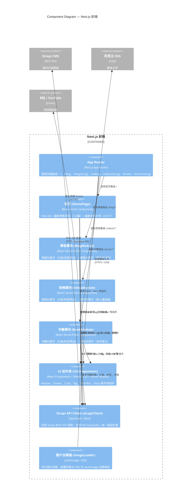

# C4 Level 3 — Component Diagram: Next.js 前端

> 展示 Next.js 前端容器内部的核心组件及其交互。面向开发者。

## 组件说明

| 组件 | 类型 | 核心职责 |
|---|---|---|
| App Router | 路由层 | Next.js 14 App Router，定义所有页面路由和布局（`layout.tsx`） |
| HomePage | Server Component | 首页聚合展示，构建时通过 ISR 预渲染 |
| BlogModule | Server + Client | 列表页为 Server Component（SEO）；筛选栏为 Client Component（交互） |
| VideoModule | Server + Client | 同 BlogModule，视频详情页动态加载 iframe（避免 SSR 报错） |
| BookModule | Server + Client | 书籍列表 Server Component + 详情页富文本渲染 |
| UIComponents | 纯展示组件 | 设计系统组件库，无业务逻辑，支持 Tailwind 主题 Token |
| strapiClient | 服务层 | 唯一与 Strapi API 通信的模块，集中管理 API Token 和 revalidate 配置 |
| imageLoader | 工具层 | 配置 `next/image` 远程域名白名单（OSS 域名），提供统一图片优化 |

## 渲染策略

| 页面 | 策略 | revalidate |
|---|---|---|
| 首页 `/` | ISR | 60s |
| 博客列表 `/blog` | ISR | 60s |
| 博客详情 `/blog/[slug]` | ISR | 60s |
| 视频列表 `/videos` | ISR | 60s |
| 视频详情 `/videos/[slug]` | ISR | 60s |
| 书籍列表 `/books` | ISR | 60s |
| 书籍详情 `/books/[slug]` | ISR | 60s |
