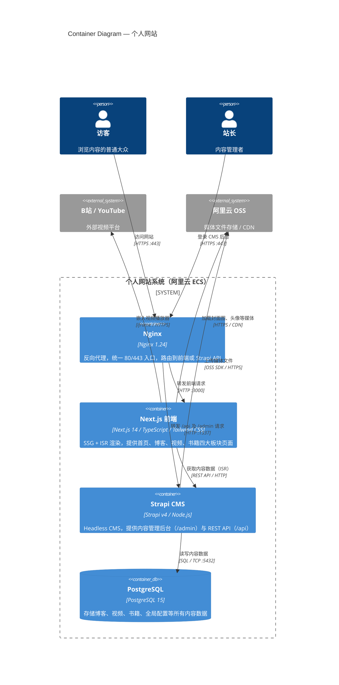

# C4 Level 2 — Container Diagram

> 展示个人网站系统内部各可部署容器及其交互关系。面向技术架构师和开发者。

## 容器说明

| 容器 | 技术 | 职责 |
|---|---|---|
| Nginx | Nginx 1.24 | 唯一对外入口，处理 SSL 终止，按路径路由到 Next.js（默认）或 Strapi（`/api`、`/admin`、`/uploads`） |
| Next.js 前端 | Next.js 14 + TypeScript | 页面渲染引擎；使用 ISR（revalidate 60s）保证内容时效性；Tailwind CSS + Framer Motion 实现 Apple 式视觉 |
| Strapi CMS | Strapi v4 + Node.js | 内容管理后台 + REST API 服务；内容类型：Blog、Video、Book、Global |
| PostgreSQL | PostgreSQL 15 | 持久化所有结构化内容数据，仅 Strapi 内部访问 |

## 端口分配

| 服务 | 内部端口 | 对外暴露 |
|---|---|---|
| Nginx | 80 / 443 | ✅ 公网 |
| Next.js | 3000 | ❌ 仅内网（Nginx 代理） |
| Strapi | 1337 | ❌ 仅内网（Nginx 代理） |
| PostgreSQL | 5432 | ❌ 仅本机 |
