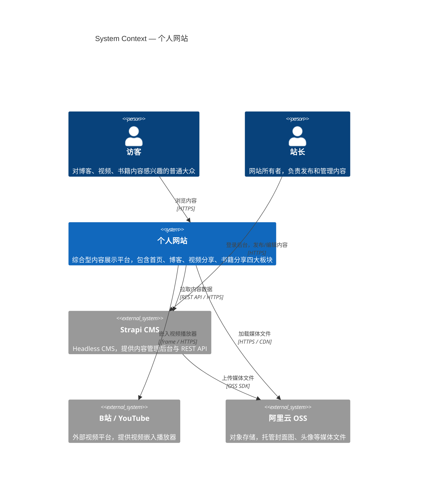

# C4 Level 1 — System Context

> 展示个人网站系统与外部参与者及外部系统之间的关系。面向所有人（含非技术受众）。

## 说明

| 参与者 / 系统 | 角色 |
|---|---|
| 访客 | 网站的主要读者，无需登录即可访问所有内容 |
| 站长 | 唯一内容管理者，通过 Strapi 后台发布文章、视频、书籍 |
| 个人网站 | Next.js 前端，负责页面渲染与内容展示 |
| Strapi CMS | 自托管 Headless CMS，数据存储于 PostgreSQL，提供 REST API |
| B站 / YouTube | 外部视频平台，网站以 iframe 形式嵌入，不自托管视频 |
| 阿里云 OSS | 媒体文件存储，Strapi 上传后由前端直接通过 CDN 加载 |
