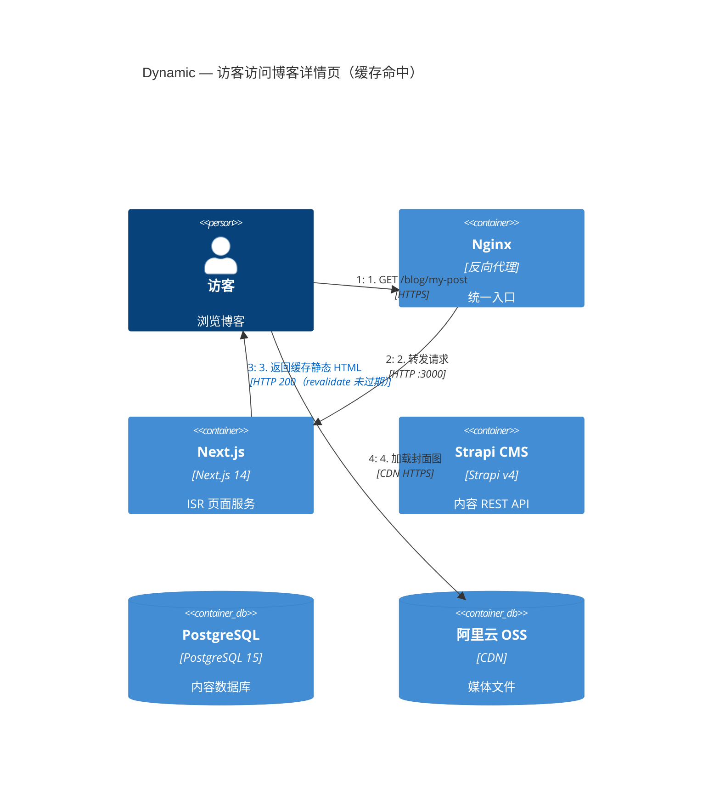
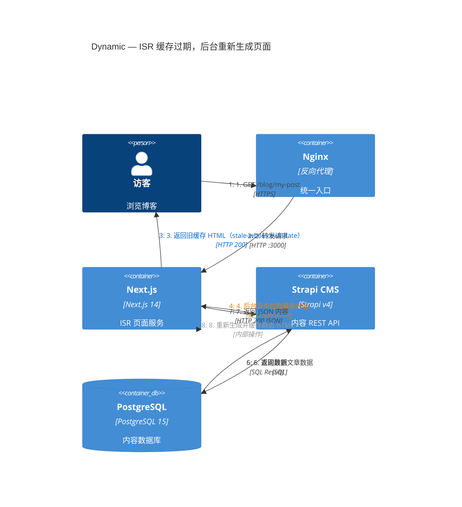
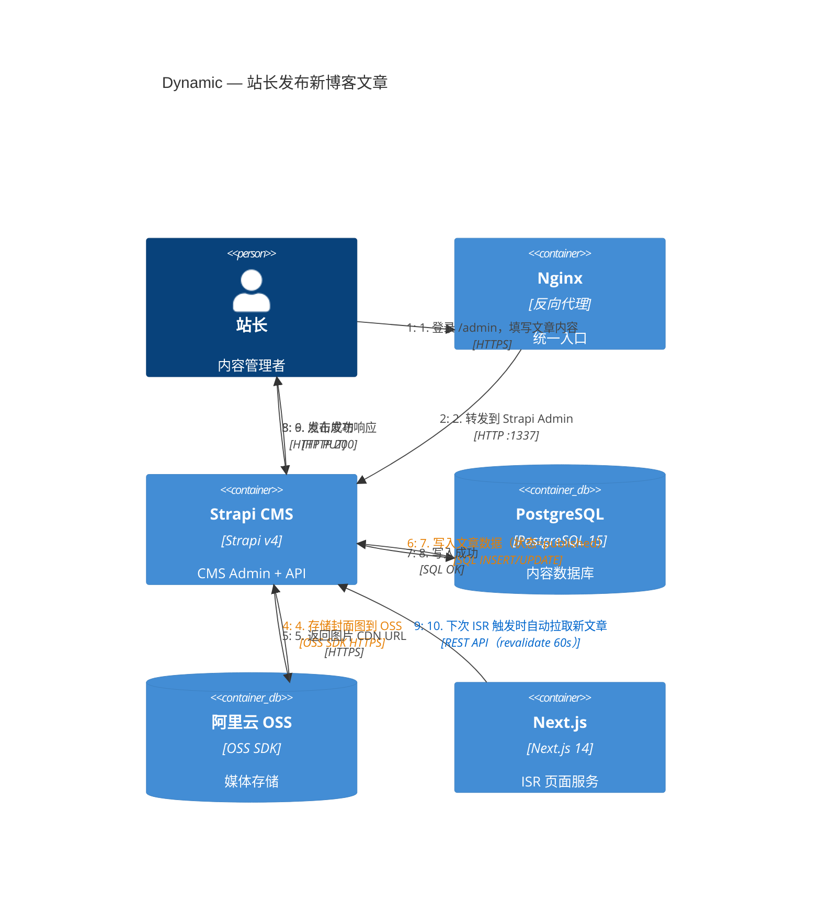

# C4 Dynamic — 关键请求流程

> 展示两个核心场景的请求序列：访客首次访问页面（ISR 缓存命中 & 未命中）以及站长发布新内容后的内容更新流程。

---

## 场景一：访客访问博客详情页（ISR 缓存命中）

---

## 场景二：访客访问页面（ISR 缓存过期，触发后台重新生成）

---

## 场景三：站长通过 Strapi 发布新博客文章

---

## 流程总结

| 场景 | 关键机制 | 用户感知 |
|---|---|---|
| ISR 缓存命中 | Next.js 直接返回静态 HTML | 极速响应（< 100ms） |
| ISR 缓存过期 | stale-while-revalidate：先返回旧页面，后台异步更新 | 无感知，下次刷新看到新内容 |
| 站长发布内容 | Strapi 写库 → 60s 内 ISR 自动重新生成页面 | 发布后约 60s 内全网更新 |
